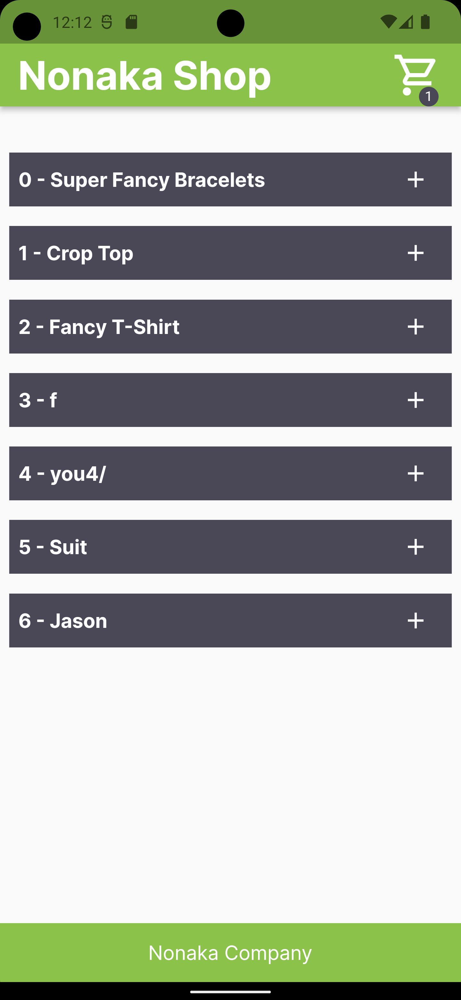

# nonaka_shop

O seu app de compras online

## Tecnologias

O projeto foi desenvolvido no Flutter utilizando de uma API externa para a obtenção dos dados.

## Como executar

Para executar o projeto, é necessário ter o Flutter instalado em sua máquina. Para isso, siga as
instruções do site (oficial do Flutter)[https://docs.flutter.dev/get-started/install].

Apos a instalação, será necessário executar os seguintes comandos:
```bash
    flutter pub get
    
    flutter run
```

## Imagens do projeto




